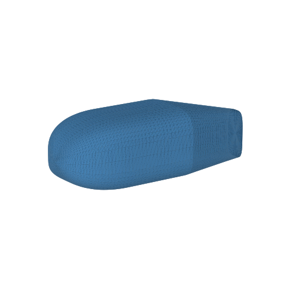
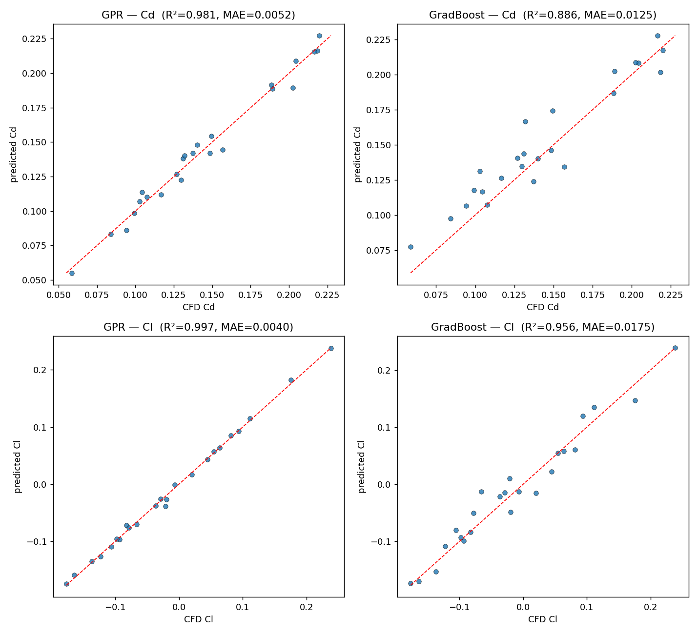
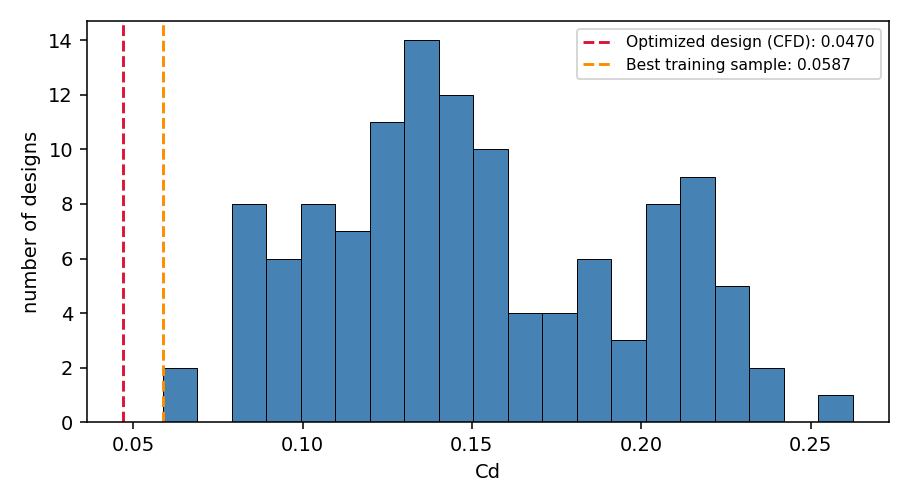

# AeroSurrogate

A machine learning surrogate model for aerodynamic drag prediction, trained on CFD data I generated with an automated OpenFOAM pipeline, then used to optimize a vehicle body shape. The final optimized design was verified with a blind CFD run: predicted Cd 0.0493 ± 0.0057, CFD result 0.0470. That is 64% lower than the mid-range seed design and 20% lower than any of the 120 designs in the training data.

<p align="center">
  
</p>
<p align="center"><em>The optimized geometry: long tapered tail, strong boat-tailing, moderate 11.8° backlight angle.</em></p>

## Workflow

```
parametric geometry (5 variables, fixed frontal area)
        │  Latin Hypercube sampling, N = 120
        ▼
automated CFD pipeline — OpenFOAM in Docker (RANS, k-ω SST, Re = 2×10⁶)
        │  120/120 runs, 14.9 h on one laptop, mesh independence verified
        ▼
Gaussian Process surrogate — Cd R² = 0.981, MAE = 0.005 on held-out designs
        │  ~100,000× cheaper per evaluation than CFD, with uncertainty estimates
        ▼
OpenEvolve optimization — score = −(Cd + σ), uncertainty-penalized
        │  200 iterations, LLM-driven evolutionary search
        ▼
blind CFD validation — predicted Cd 0.0493 ± 0.0057, CFD gave 0.0470
```

## Results

| Stage | Result |
|---|---|
| CFD campaign | 120/120 runs completed unattended, 7.4 min average per case |
| Mesh study | coarse mesh over-predicted Cd by 18%; production mesh within 0.6% of a finer reference |
| Surrogate (GPR) | Cd: R² = 0.981, MAE = 0.0052. Cl: R² = 0.997. Outperformed gradient boosting at this dataset size |
| Blind test 1 (hand-picked shape) | predicted 0.0549 ± 0.0057, CFD 0.0589 |
| Blind test 2 (optimized shape) | predicted 0.0493 ± 0.0057, CFD 0.0470 |
| Overall | optimized Cd is 20% below the best design in the training data |

<p align="center">
  
</p>
<p align="center"><em>Predicted vs CFD values on 24 held-out test designs.</em></p>

<p align="center">
  
</p>
<p align="center"><em>Cd distribution of the 120 training designs. The optimized design (red line) is below all of them.</em></p>

## Methodology notes

- A three-level mesh refinement study came first. The coarse mesh inflated drag by 18%, which would have contaminated the whole dataset, so the campaign ran on a finer mesh that agreed within 0.6% of an even finer reference.
- All 120 designs share the same frontal area. Length, width, and height are fixed, so Cd differences come from shape only.
- The optimizer's score is −(Cd + σ), where σ is the GPR's own uncertainty estimate. This keeps the search out of regions where the model has no training data.
- Permutation importance ranks boat-tail angle and tail length as the dominant parameters for drag, which matches the expected wake physics of ground vehicles. The optimizer also settled at a moderate backlight angle instead of the maximum, consistent with the Ahmed body drag-crisis behavior, without that being coded anywhere.

## Limitations

- The 5-parameter body family captures gross shape effects (nose, tail, taper) but not real-vehicle features like wheels, underbody detail, or surface curvature continuity.
- Mesh independence was verified on one design (run_000). Mesh error could differ elsewhere in the design space, particularly at extreme tail angles.
- No prism layers in the mesh: pressure drag is resolved well but wall friction is under-resolved, so absolute Cd values are likely biased low. Comparisons between designs are less affected.
- Only two blind CFD validation points. Both landed within the model's uncertainty band, but that is limited coverage of the design space.
- Single operating point: 30 m/s, zero yaw, steady RANS.

All of these are addressable with more compute: mesh checks at design-space corners, prism-layer meshing, more validation runs, multi-condition datasets.

## Repository guide

| File | Role |
|---|---|
| `src/geometry.py` | parametric body → watertight STL (5 shape variables, fixed frontal area) |
| `src/sample_designs.py` | Latin Hypercube sampling → `designs.csv` + STLs |
| `src/run_cfd_local.py` | automated OpenFOAM pipeline (Docker): mesh, solve, extract Cd/Cl |
| `src/mesh_check.py`, `src/mesh_check2.py` | mesh independence study |
| `src/run_batch.py` | full 120-run campaign on the validated production mesh |
| `src/train_surrogate.py` | GPR + gradient boosting, holdout validation, parity plots → `surrogate.joblib` |
| `src/validate_shape.py` | predict any shape, optionally verify with a real CFD run (`--cfd`) |
| `OpenEvolve/` | OpenEvolve optimization files (seed program, evaluator, config) |
| `results.csv` | the 120-run CFD dataset (design variables → Cd, Cl, forces) |
| `results_coarse.csv` | archived coarse-mesh results from the mesh study |
| `report/` | full project report (PDF) |
| `legacy/run_cfd.py` | original SimScale API runner, retired when the LBM solver turned out to require GPU quota not included in the academic plan; the pipeline was rebuilt on containerized OpenFOAM |

## Reproducing it

```bash
pip install -r requirements.txt
# run all commands from the repository root
# Docker Desktop must be running
# for the optimization step: export OPENAI_API_KEY=<your Gemini API key>

python3 src/sample_designs.py            # generate the 120-design DoE
python3 src/mesh_check.py                # (optional) mesh sensitivity check
python3 src/run_batch.py                 # full CFD campaign (~15 h)
python3 src/train_surrogate.py           # train + validate the surrogate
python3 src/validate_shape.py 0.30 3.0 0.38 12 18 --cfd    # test any shape against CFD
python3 -m openevolve.cli OpenEvolve/initial_program.py OpenEvolve/evaluator.py --config OpenEvolve/config.yaml --iterations 200
```

Stack: Python, OpenFOAM v2412 (Docker), scikit-learn, trimesh, SciPy, OpenEvolve (Gemini).

---

*Muhammad Abdullah Imran, Mechanical Engineering, CSULB. Part of a series of optimization projects (airfoil, bridge truss, bluff body, heat sink, 3D car body) built on the same OpenEvolve workflow.*
